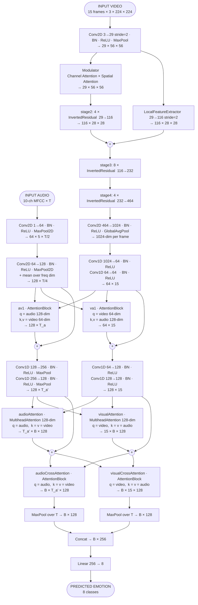

```mermaid
graph TD

    %% ── INPUTS ──────────────────────────────────────────────────────────────
    A([INPUT AUDIO\n10-ch MFCC × T])
    V([INPUT VIDEO\n15 frames × 3 × 224 × 224])

    %% ── AUDIO STAGE 1 ───────────────────────────────────────────────────────
    A  --> A1["Conv2D 1→64 · BN · ReLU · MaxPool2D\n→ 64 × 5 × T/2"]
    A1 --> A2["Conv2D 64→128 · BN · ReLU · MaxPool2D\n+ mean over freq dim\n→ 128 × T/4"]

    %% ── VIDEO BACKBONE ──────────────────────────────────────────────────────
    V  --> V1["Conv2D 3→29 stride=2 · BN · ReLU · MaxPool\n→ 29 × 56 × 56"]
    V1 --> VMOD["Modulator\nChannel Attention × Spatial Attention\n→ 29 × 56 × 56"]
    V1 --> VLOC["LocalFeatureExtractor  29→116 stride=2\n→ 116 × 28 × 28"]
    VMOD --> VSTG2["stage2: 4 × InvertedResidual  29→116\n→ 116 × 28 × 28"]
    VSTG2 --> VADD((" + "))
    VLOC  --> VADD
    VADD  --> VSTG3["stage3: 8 × InvertedResidual  116→232"]
    VSTG3 --> VSTG4["stage4: 4 × InvertedResidual  232→464"]
    VSTG4 --> VC5["Conv2D 464→1024 · BN · ReLU · GlobalAvgPool\n→ 1024-dim per frame"]

    %% ── VIDEO STAGE 1 (temporal) ────────────────────────────────────────────
    VC5 --> VT1["Conv1D 1024→64 · BN · ReLU\nConv1D 64→64   · BN · ReLU\n→ 64 × 15"]

    %% ── INTERMEDIATE TRANSFORMER BLOCK ──────────────────────────────────────
    A2  --> AV1["av1 · AttentionBlock\nq = audio 128-dim\nk,v = video 64-dim\n→ 128 × T_a"]
    VT1 --> AV1
    VT1 --> VA1["va1 · AttentionBlock\nq = video 64-dim\nk,v = audio 128-dim\n→ 64 × 15"]
    A2  --> VA1

    AV1 --> AR1((" + "))
    A2  --> AR1
    VA1 --> VR1((" + "))
    VT1 --> VR1

    %% ── STAGE 2 ─────────────────────────────────────────────────────────────
    AR1 --> AS2["Conv1D 128→256 · BN · ReLU · MaxPool\nConv1D 256→128 · BN · ReLU · MaxPool\n→ 128 × T_a'"]
    VR1 --> VS2["Conv1D 64→128 · BN · ReLU\nConv1D 128→128 · BN · ReLU\n→ 128 × 15"]

    %% ── SELF-ATTENTION (cross-modal) ────────────────────────────────────────
    AS2 --> AATTN["audioAttention · MultiheadAttention 128-dim\nq = audio,  k = v = video\n→ T_a' × B × 128"]
    VS2 --> AATTN
    VS2 --> VATTN["visualAttention · MultiheadAttention 128-dim\nq = video,  k = v = audio\n→ 15 × B × 128"]
    AS2 --> VATTN

    AATTN --> AR2((" + "))
    AS2   --> AR2
    VATTN --> VR2((" + "))
    VS2   --> VR2

    %% ── FINAL CROSS-ATTENTION ────────────────────────────────────────────────
    AR2 --> ACA["audioCrossAttention · AttentionBlock\nq = audio,  k = v = video\n→ B × T_a' × 128"]
    VR2 --> ACA
    VR2 --> VCA["visualCrossAttention · AttentionBlock\nq = video,  k = v = audio\n→ B × 15 × 128"]
    AR2 --> VCA

    %% ── POOLING & CLASSIFICATION ─────────────────────────────────────────────
    ACA --> APOOL["MaxPool over T  →  B × 128"]
    VCA --> VPOOL["MaxPool over T  →  B × 128"]
    APOOL --> CAT["Concat  →  B × 256"]
    VPOOL --> CAT
    CAT --> CLS["Linear 256 → 8"]
    CLS --> OUT([PREDICTED EMOTION\n8 classes])
```
