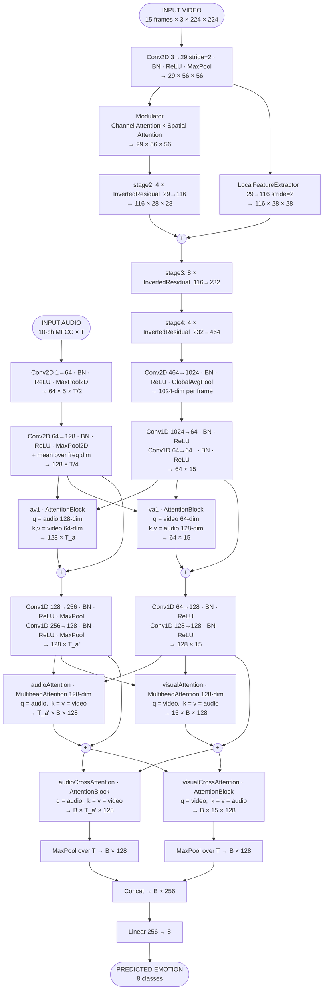
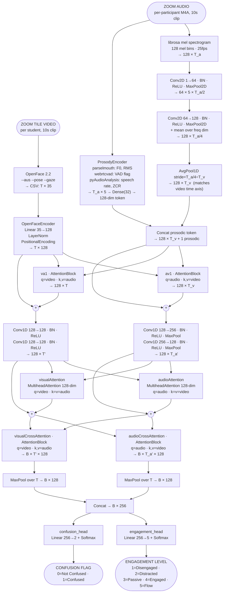

# Architecture — AVTCA-Research

> This file is the single source of truth for all architecture diagrams.
> Updated whenever any module, data flow, input, output, or component changes.
> Current project phase: **Pivoting from RAVDESS emotion detection → Classroom engagement detection.**

---

## Current Status

| Component | Status |
|---|---|
| RAVDESS emotion model (8-class) | ✅ Baseline 71.25% — **v2 runs (ep 3): h8=78.3%, h4=79.6% — 4 runs active with nohup, 2 per GPU at ~4GB each** |
| CREMA-D preprocessing pipeline | ✅ Done — `preprocessing/cremad/` (extract_audios, extract_faces, create_annotations) |
| CREMA-D dataset class + registry | ✅ Done — `datasets/cremad.py`, registered as `'CREMAD'` in `src/dataset.py` |
| Engagement model (5-class + confusion) | 🔴 In design — architecture planned, **design gaps identified (see below)**, not yet implemented |
| OpenFace feature pipeline | 🔴 Not started |
| Zoom tile extractor | 🔴 Not started |
| Dual audio path (prosody encoder) | 🔴 Not started — **ProsodyEncoder design revised to FiLM conditioning (see Architecture 2 notes)** |
| Audio temporal subsampling (AdaptiveAvgPool1d) for modality parity | ✅ Implemented — `models/multimodal_cnn.py` `forward_feature_3` |
| Modality dropout (train-time, p=0.15) | ✅ Implemented — `models/multimodal_cnn.py` `forward_feature_3` |
| Cross-modal fix in audioAttention/visualAttention | ✅ Implemented — was still self-attention; now cross-modal |
| Attention output dropout (p=0.1) + residual connections | ✅ Implemented — after MultiheadAttention in `forward_feature_3` |
| Attention pooling replacing MaxPool | ✅ Implemented — `AttentionPool` class, replaces `.max(dim=1).values` |
| Role conditioning in forward pass | 🔴 Not started — **critical gap; gaze is behaviorally inverted by speaker/listener role** |

---

## Dataset Integration: CREMA-D

**91 actors**, 7,442 clips, **6 emotion classes**: anger, disgust, fear, happy, neutral, sad.

File layout expected under `datasets/CREMAD/` (video-only — no `AudioWAV/` needed):
```
datasets/CREMAD/
  VideoFlash/   1001_IEO_ANG_HI.flv              (source FLV — download only this directory)
                1001_IEO_ANG_HI_facecroppad.npy  (15 × 224 × 224 × 3, produced by extract_faces.py)
                1001_IEO_ANG_HI_croppad.wav      (3.6 s audio, extracted from FLV by extract_audios.py)
```

Audio is extracted directly from FLV via librosa/ffmpeg — `AudioWAV/` is not downloaded or used.

**Label map** (integer in annotations file; 0-indexed in model):

| Code | Emotion | Label |
|---|---|---|
| ANG | Anger | 1 |
| DIS | Disgust | 2 |
| FEA | Fear | 3 |
| HAP | Happy | 4 |
| NEU | Neutral | 5 |
| SAD | Sad | 6 |

**Actor split** (sorted by actor ID, deterministic):

| Split | Actor count | Actor IDs |
|---|---|---|
| Test | 13 | indices 0–12 |
| Val | 13 | indices 13–25 |
| Train | 65 | indices 26–90 |

**Preprocessing run order** (once `VideoFlash/` is populated):
```bash
python preprocessing/cremad/extract_audios.py --data_root datasets/CREMAD
python preprocessing/cremad/extract_faces.py --data_root datasets/CREMAD
python preprocessing/cremad/create_annotations.py --data_root datasets/CREMAD
```

> **Download blocked:** GitHub LFS budget for `CheyneyComputerScience/CREMA-D` is exhausted — FLV binaries cannot be fetched via `git clone`/`git lfs pull`. Use Kaggle (`ejlok1/cremad`) or the CMU HTTP mirror to populate `VideoFlash/` before running these scripts. If `AudioWAV/`-only is chosen instead, the preprocessing scripts must be reverted to the dual-directory layout.

**Key difference from RAVDESS:** all files live in a single flat directory (`VideoFlash/`) rather than per-actor subdirectories. The `CREMAD` dataset class and path resolver handle this transparently.

---

## Architecture 1: Original AVT-CA (RAVDESS Emotion Detection)

> Status: **Implemented and working.** Do not modify this diagram unless the RAVDESS code changes.
> Best checkpoint: `results/mel_h8_lr001_e75/RAVDESS_multimodal_cnn_15_best.pth`



---

## Architecture 2: AVT-CA-Engagement (Classroom Engagement Detection)

> Status: **Planned — not yet implemented.** See `docs/plan.md` Section 4 for full rationale.
> Target: 5-level engagement scale + binary confusion flag, per student per 10-second window.
> Input source: Zoom gallery view recording + per-participant audio tracks.

### Key differences from Architecture 1

| Dimension | Architecture 1 (RAVDESS) | Architecture 2 (Engagement) |
|---|---|---|
| Video input | Raw face frames (15 × 224×224 RGB) | OpenFace 2.2 feature vectors (T × 35: 17 AUs + 6 pose + 6 gaze + 2 EAR) |
| Audio input | MFCC/mel spectrogram only | Mel spectrogram (existing CNN path) + prosodic features (FiLM conditioning, not a sequence token) |
| Output | Single head → 8 emotion classes | Dual heads: engagement (5-class ordinal, CORN loss) + confusion (binary, BCE) |
| Loss | Cross-entropy | CORN loss (ordinal) + BCE (confusion): `λ1·L_corn + λ2·L_bce` |
| Temporal window | Fixed dataset clips | Sliding 10s window, 5s overlap, over live Zoom stream |
| Video backbone | EfficientFaceTemporal (heavy CNN) | OpenFaceEncoder: Linear(35→128) + LayerNorm + PositionalEncoding (lightweight) |
| Role conditioning | None | `role_embedding(is_speaking)` added to video tokens before first attention block |
| Temporal aggregation | MaxPool (peak only) | Learned attention pooling (weighted sum over T) |
| Cross-attention stages | 3 | **1 at pilot scale (<5K clips); scale to 2 at Phase 1 scale** |
| Attention dropout | None | Dropout(0.1–0.2) on attention output before residual add |

### Why OpenFace features replace raw frames

Neural Computing and Applications (Springer, 2025) tested on DAiSEE:
- XGBoost + 17 AUs = **82.9%** accuracy
- EfficientNet end-to-end = **47.2%** accuracy

On small datasets (pilot phase: ~1,500 clips), structured AU features generalize far better than learned CNN features. Raw frame path can be reintroduced once dataset reaches 5,000+ clips.

### Diagram



### Design Gaps — Must Fix Before Implementation (identified 2026-05-18)

**1. ProsodyEncoder: single token → FiLM conditioning**
Current diagram shows prosody token concatenated into the temporal sequence. A single 128-dim summary token attends identically at every time step — does not interact correctly with cross-attention.
Correct implementation:
```python
gamma, beta = Linear(128, 128)(prosody_summary).chunk(2, dim=-1)
audio_features = gamma * audio_features + beta  # scale+shift before attention
```

**2. Role conditioning must be in the forward pass**
`is_speaking` flag is in manifest.csv but there is no conditioning path in the architecture. Gaze features are behaviorally inverted by speaker vs listener role (Maran et al. 2021) — training without this produces contradictory supervision.
Correct implementation (before first AttentionBlock):
```python
role_embed = self.role_embedding(is_speaking.long())  # B × 128
video_features = video_features + role_embed.unsqueeze(1)
```

**3. MaxPool → attention pooling**
MaxPool picks the single peak activation and discards all temporal context. Engagement states have temporal signatures (boredom develops over minutes, confusion has AU onset/offset patterns).
Correct implementation:
```python
attn_weights = torch.softmax(self.pool_proj(x), dim=1)  # B × T × 1
pooled = (attn_weights * x).sum(dim=1)                  # B × 128
```

**4. Cross-attention stages: 3 → 1 at pilot scale**
Architecture 2 currently inherits all 3 cross-attention stages from Architecture 1. At pilot scale (<5K clips), this will overfit. Run with 1 cross-attention stage + 1 transformer encoder layer. Add the second stage after Phase 1 data (10K+ clips) is assembled.

**5. CORN loss required for ordinal output**
Plain `CrossEntropyLoss` on 5-level engagement treats level-3-vs-5 error identically to level-3-vs-4 error. Replace with CORN loss (coral-pytorch library). 5-line change to the output head and loss function. MocoRank (from CMOSE paper) is the stronger option after Phase 1 data enables contrastive pair construction.

### New modules to implement (tracking against plan.md Section 9)

| Module | File | Plan.md item | Status |
|---|---|---|---|
| `AttentionPool` class + attention pooling (replace MaxPool) | `models/multimodal_cnn.py` | — | ✅ Done |
| Audio `AdaptiveAvgPool1d` temporal subsampling | `models/multimodal_cnn.py` | E11 | ✅ Done |
| Cross-modal fix + residuals + attention dropout | `models/multimodal_cnn.py` | — | ✅ Done |
| Modality dropout (p=0.15) | `models/multimodal_cnn.py` | E12 | ✅ Done |
| `OpenFaceEncoder` | `models/multimodal_cnn.py` | E8 | 🔴 Not started |
| `ProsodyEncoder` (FiLM, not token) | `models/multimodal_cnn.py` | E9 | 🔴 Not started |
| Role conditioning embedding | `models/multimodal_cnn.py` | — | 🔴 Not started |
| Dual output heads + CORN loss | `models/multimodal_cnn.py` | E10 | 🔴 Not started |
| `EngagementDataset` | `datasets/engagement.py` | E6 | 🔴 Not started |
| New CLI flags | `src/opts.py` | — | 🔴 Not started |
| OpenFace 2.2 setup | `preprocessing/zoom/` | E7 | 🔴 Not started |
| `extract_tiles.py` | `preprocessing/zoom/` | E3 | 🔴 Not started |
| `extract_prosody.py` | `preprocessing/zoom/` | E4 | 🔴 Not started |
