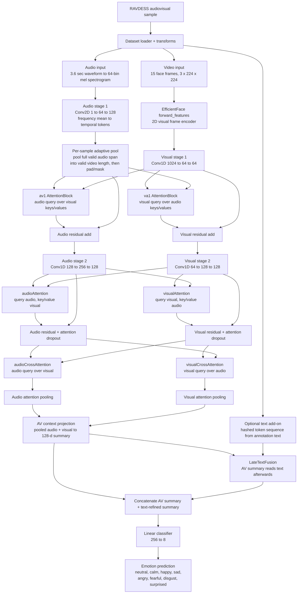
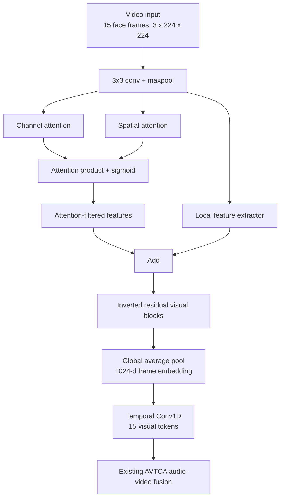
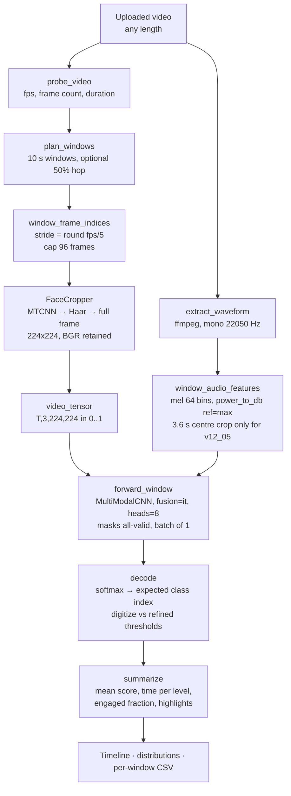

# Current Architecture: RAVDESS Best Verified Model

This file documents the best verified RAVDESS architecture, the current late text add-on path, and the V4 visual-backbone experiment.

## Best Checkpoint

| Item | Value |
|---|---|
| Result folder | `results/v3_01_baseline_mel_h4` |
| Checkpoint | `RAVDESS_multimodal_cnn_15_best.pth` |
| Model path | `MultiModalCNN.forward_feature_3` in `models/multimodal_cnn.py` |
| Dataset | RAVDESS, 8 emotion classes |
| Audio feature | Mel spectrogram |
| Fusion | `it` |
| Attention heads | 4 |
| SpecAugment | Off |
| Audio channel gate | Off |
| Best validation accuracy | 82.9167% at epoch 40 |
| Test accuracy | 81.8750% on 480 held-out test samples |

This remains the best overall model after the V4 `attention_local` experiments. The V4 branch reduced final training accuracy, but it did not beat this checkpoint on validation or held-out test accuracy.

## Best V4 Attention-Local Checkpoint

| Item | Value |
|---|---|
| Result folder | `results/v4_05_attention_local_pretrain_h4_lr001` |
| Checkpoint | `RAVDESS_multimodal_cnn_15_best.pth` |
| Visual backbone | `AttentionLocalVisualTemporal` via `--visual_backbone attention_local` |
| Pretrain | Compatible partial load from `pretrained/EfficientFace_Trained_on_AffectNet7.pth` |
| Best validation accuracy | 79.7917% |
| Test accuracy | 79.7917% on 480 held-out test samples |
| Final train accuracy | 93.8151% |

V4 is useful as an overfitting study: it lowers train accuracy compared with EfficientFace, but it also lowers test accuracy. Therefore the production/best-model diagram below still uses the V3 EfficientFace baseline.

## Architecture Diagram


```mermaid
flowchart TD

    RAW["RAVDESS audiovisual sample"] --> PRE["Dataset loader + transforms"]

    PRE --> VID["Video input<br/>15 face frames, 3 x 224 x 224"]
    PRE --> AUD["Audio input<br/>3.6 sec waveform to 64-bin mel spectrogram"]
    PRE --> TXT["Optional text add-on<br/>hashed token sequence from annotation text"]

    VID --> VF["EfficientFace forward_features<br/>2D visual frame encoder"]
    VF --> VS1["Visual stage 1<br/>Conv1D 1024 to 64 to 64"]

    AUD --> AS1["Audio stage 1<br/>Conv2D 1 to 64 to 128<br/>frequency mean to temporal tokens"]
    AS1 --> ALIGN["Per-sample adaptive pool<br/>pool full valid audio span<br/>into valid video length, then pad/mask"]

    ALIGN --> AV1["av1 AttentionBlock<br/>audio query over visual keys/values"]
    VS1 --> AV1
    VS1 --> VA1["va1 AttentionBlock<br/>visual query over audio keys/values"]
    ALIGN --> VA1

    AV1 --> ARES1["Audio residual add"]
    ALIGN --> ARES1
    VA1 --> VRES1["Visual residual add"]
    VS1 --> VRES1

    ARES1 --> AS2["Audio stage 2<br/>Conv1D 128 to 256 to 128"]
    VRES1 --> VS2["Visual stage 2<br/>Conv1D 64 to 128 to 128"]

    AS2 --> MHA_A["audioAttention<br/>query audio, key/value visual"]
    VS2 --> MHA_A
    VS2 --> MHA_V["visualAttention<br/>query visual, key/value audio"]
    AS2 --> MHA_V

    MHA_A --> ARES2["Audio residual + attention dropout"]
    AS2 --> ARES2
    MHA_V --> VRES2["Visual residual + attention dropout"]
    VS2 --> VRES2

    ARES2 --> FCA["audioCrossAttention<br/>audio query over visual"]
    VRES2 --> FCA
    VRES2 --> FCV["visualCrossAttention<br/>visual query over audio"]
    ARES2 --> FCV

    FCA --> AP["Audio attention pooling"]
    FCV --> VP["Visual attention pooling"]
    AP --> AVC["AV context projection<br/>pooled audio + visual to 128-d summary"]
    VP --> AVC
    AVC --> TADD["LateTextFusion<br/>AV summary reads text afterwards"]
    TXT --> TADD
    AVC --> CAT["Concatenate AV summary + text-refined summary"]
    TADD --> CAT
    CAT --> CLS["Linear classifier<br/>256 to 8"]
    CLS --> OUT["Emotion prediction<br/>neutral, calm, happy, sad,<br/>angry, fearful, disgust, surprised"]
```

## Late Text Add-On

The current training path does not fuse audio, visual, and text in parallel. Instead, it follows a staged order:

1. The model first reads facial and vocal behavior through the existing audio-visual attention stack.
2. It compresses that joint audio-visual evidence into an intermediate AV context.
3. Only after that summary exists does the model read the text and use it as a gated refinement step.
4. The classifier receives both the original AV summary and the text-refined summary.

This keeps text as a late add-on instead of letting it dominate early fusion. If a dataset has no text, the text add-on simply falls back to the AV summary.

## Code Mapping

| Diagram section | Code location |
|---|---|
| RAVDESS loader, train/val/test split | `datasets/ravdess.py` |
| Video frame loading and transforms | `datasets/ravdess.py`, `src/data/transforms.py` |
| Audio crop/pad and mel extraction | `datasets/ravdess.py` |
| EfficientFace visual encoder | `models/multimodal_cnn.py`, `models/efficient_face.py`, `models/modulator.py` |
| V4 attention-local visual encoder | `AttentionLocalVisualTemporal` in `models/multimodal_cnn.py` |
| Audio CNN stages | `AudioCNNPool` in `models/multimodal_cnn.py` |
| Audio temporal alignment | `_adaptive_align_audio_to_video` in `MultiModalCNN` (`models/multimodal_cnn.py`) — pools each sample's full valid post-stage-1 audio span into that sample's valid video length, then pads/masks to batch target length |
| Train/val temporal sampling | `collate_variable_length_batch` / `_random_synced_audio_video_crop` in `src/data/temporal.py`; `--frame_sampling` (val/test) and `--train_frame_sampling random` (train-only synced crop) |
| Intermediate `av1` / `va1` attention | `forward_feature_3` in `models/multimodal_cnn.py` |
| Cross-modal `audioAttention` / `visualAttention` | `forward_feature_3` in `models/multimodal_cnn.py` |
| Final `audioCrossAttention` / `visualCrossAttention` | `forward_feature_3` in `models/multimodal_cnn.py` |
| Modality dropout (train) and modality ablation (eval) | `forward_feature_3` in `models/multimodal_cnn.py` — both act on the aligned `x_audio` / `x_visual` streams immediately before `av1`/`va1` |
| Attention pooling | `AttentionPool` in `models/multimodal_cnn.py` |
| AV summary projection | `self.av_context` in `MultiModalCNN.__init__` |
| Late text refinement | `LateTextFusion` and `self.text_addon` in `models/multimodal_cnn.py` |
| Optional text token batching | `collate_variable_length_batch` in `src/data/temporal.py` |
| 8-class classifier | `classifier_1` in `models/multimodal_cnn.py` |

## Paper Mapping

| Architecture section | Paper/source | What was taken |
|---|---|---|
| Overall two-stream audio/video design | AVTCA | Separate audio and visual encoders before fusion. |
| Bidirectional cross-modal agreement | AVTCA | Audio attends to visual tokens and visual attends to audio tokens. |
| Intermediate and final cross-attention blocks | AVTCA | The `av1` / `va1` stage and final `audioCrossAttention` / `visualCrossAttention` stage. |
| EfficientFace visual backbone with channel/spatial/local feature refinement | AVTCA / EfficientFace components used by the AVTCA implementation | Face-frame feature extraction before temporal modeling. |
| Audio CNN over mel features | AVTCA-style audio branch | Spectrogram-like audio features encoded with convolutional layers. |
| Residual paths around attention | Transformer/AVTCA design pattern | Preserve unimodal information while adding cross-modal information. |
| Adaptive audio-video temporal alignment | Codebase fix, not directly copied from a paper | Per-sample adaptive pool: use full valid audio span (not video length as audio length), pool into valid video span, then pad/mask before intermediate attention. Critical for variable-length EngageNet/DAISEE clips. |
| Synced train-only temporal crop | Standard temporal augmentation adapted for AV | `--train_frame_sampling random` crops video and matching relative audio window together; val/test stay deterministic via `--frame_sampling`. |
| Cross-modal MHA in `audioAttention` / `visualAttention` | Codebase correction of the intended AVTCA behavior | Uses audio as query over visual and visual as query over audio, instead of self-attention. |
| Attention pooling | Codebase improvement over the original max-pooling implementation | Learns which time steps matter instead of taking only the max activation. |
| Late text conditioning | Codebase extension for real-world multimodal sequencing | Text is read only after the audio-visual stack has formed a joint context. |
| SpecAugment | SpecAugment paper, tested as an ablation only | Training-time audio augmentation; not part of the winning architecture. |
| TemporalChannelGate | Squeeze-and-excitation / AVTCA channel-attention idea, tested as an ablation only | Optional audio channel recalibration; not part of the winning architecture. |
| Attention-local visual backbone | Codebase V4 experiment inspired by channel/spatial/local visual processing | Lighter visual extractor intended to reduce EfficientFace memorization; did not beat the V3 baseline. |

## V3 Test Result Summary

| Run | Best validation | Test top-1 |
|---|---:|---:|
| `v3_01_baseline_mel_h4` | 82.9167% | 81.8750% |
| `v3_02_specaugment_mel_h4` | 80.0000% | 79.3750% |
| `v3_03_audio_channel_gate_mel_h4` | 81.6667% | 76.8750% |
| `v3_04_specaugment_audio_gate_mel_h4` | 81.6667% | 68.9583% |

Conclusion: the best current architecture is the baseline mel + 4-head AVTCA model without SpecAugment and without the audio channel gate.

## V4 Test Result Summary

| Run | Visual backbone | Pretrain | Learning rate | Best validation | Test top-1 | Final train |
|---|---|---:|---:|---:|---:|---:|
| `v4_05_attention_local_pretrain_h4_lr001` | `attention_local` | yes | 0.010 | 79.7917% | 79.7917% | 93.8151% |
| `v4_06_attention_local_scratch_h4_lr001` | `attention_local` | no | 0.010 | 78.1250% | 73.1250% | 92.5781% |
| `v4_07_attention_local_scratch_h4_lr005` | `attention_local` | no | 0.005 | 79.3750% | 77.9167% | 90.8984% |

The best V4 run is `v4_05_attention_local_pretrain_h4_lr001`. It reduced the final train accuracy compared with V3, but it was 2.0833 percentage points below `v3_01_baseline_mel_h4` on held-out test accuracy.

## V4 Visual Backbone

`AttentionLocalVisualTemporal` keeps the same interface as `EfficientFaceTemporal`, so the AVTCA fusion path can switch visual extractors using `--visual_backbone attention_local`.


```mermaid
flowchart TD
    VIN["Video input<br/>15 face frames, 3 x 224 x 224"] --> STEM["3x3 conv + maxpool"]
    STEM --> CH["Channel attention"]
    STEM --> SP["Spatial attention"]
    STEM --> LOCAL["Local feature extractor"]
    CH --> MUL["Attention product + sigmoid"]
    SP --> MUL
    MUL --> ATT["Attention-filtered features"]
    ATT --> ADD["Add"]
    LOCAL --> ADD
    ADD --> DEEP["Inverted residual visual blocks"]
    DEEP --> GAP["Global average pool<br/>1024-d frame embedding"]
    GAP --> TCONV["Temporal Conv1D<br/>15 visual tokens"]
    TCONV --> FUSION["Existing AVTCA audio-video fusion"]
```

The V4 idea was to force visual learning through explicit channel, spatial, and local-region processing instead of relying entirely on the stronger EfficientFace path. The result suggests that EfficientFace is not the only source of overfitting: the smaller V4 visual branch still overfit, though less severely, and did not improve the final held-out test result.

## Modality Ablation and the Audio Input Span (2026-08-07)

### Eval-time modality ablation

`MultiModalCNN` carries a runtime attribute `ablate_modality ∈ {none, audio_only, video_only}`
(default `none`; read via `getattr` so existing checkpoints load unchanged). It is applied inside
`forward_feature_3` at the **same point as the existing training modality dropout** — after
`_adaptive_align_audio_to_video`, before `av1`/`va1`:

```
aligned x_audio, x_visual
        │
        ├─ if self.training:      modality dropout, p=0.15 per stream   ── training only
        ├─ if ablate_modality:    zero the opposite stream              ── eval only
        ▼
   av1 / va1 cross-attention
```

Zeroing at this point (rather than at the raw input) means an ablated stream is exactly the condition
modality dropout already exposed the network to during training, so the ablation measures the fusion
model's reliance on each stream rather than an out-of-distribution input.

Exposed as `--ablate_modality` in `scripts/calibrate_engagement_logits.py`; recorded in the emitted
`calibration_results.json` so `scripts/compile_experiments.py` can group by it.

### Audio input span — what actually reaches the encoder

| Variant | Wav file | Clip coverage | Mel frames in | After `AudioCNNPool.forward_stage1` (÷4) | Video frames |
|---|---|---|---:|---:|---:|
| Legacy (all results before 2026-08-07) | `*_croppad.wav` | first 3.6 s of 10 s | 156 | ~39 | 50 |
| Full | `*_croppad10s.wav` | full 10 s | 432 | ~108 | 50 |

`_adaptive_align_audio_to_video` pools the post-stage-1 audio span onto each sample's valid video
length, so the *token counts* match in both variants — the alignment mechanism is working as designed.
What it cannot fix is **which span of the clip the audio covers**. In the legacy variant it stretches
3.6 s of audio across 10 s of video, so audio token *t* and video token *t* describe different moments.
The full variant is the first configuration in which the two streams are genuinely time-aligned.

This is the architectural reason the 2026-08-07 modality ablation shows no fusion gain over video-only
(plan.md Section 12.3). Runs E04/E05 retrain on the full-span audio to separate "audio is uninformative"
from "audio was misaligned".

## EngageNet Configuration — Backbone, Loss, Decoding, Augmentation (2026-08-07)

### Best-performing configuration

| Component | Setting | Note |
|---|---|---|
| Visual backbone | `EfficientFaceTemporal`, AffectNet7 pretrained | `pretrained/EfficientFace_Trained_on_AffectNet7.pth`; 2.38M trainable params total |
| Audio backbone | `AudioCNNPool`, 64-bin mel | Conv2D → freq mean-collapse → Conv1D ×2 |
| Fusion | `it` (intermediate token), 8 heads | `forward_feature_3` |
| Temporal alignment | `_adaptive_align_audio_to_video` | per-sample adaptive pool, audio → valid video length |
| Loss | `ordinal_distance`, weight **0.15** | expected-distance penalty over ordered classes; plain CE underperforms |
| Decoding | refined expected thresholds | see below |
| Text fusion | **disabled** (`--no_late_text_fusion`) | costs ~7 points when enabled (55.32 vs 62.90) |

### Expected-threshold calibration — the decoding method

Argmax discards the ordinal structure of the label space. Instead the softmax is collapsed to an
expected class index, `E = Σ_k k · P(k)`, and that scalar is cut by three learned thresholds into the
four engagement levels. Thresholds are fit by grid search **on validation** and applied unchanged to
test, so no test data enters the fit.

Three variants are produced by `scripts/calibrate_engagement_logits.py`, in increasing order of
refinement: `logit_bias` (per-class additive bias on the logits), `expected_thresholds` (coarse grid,
step 0.05), `refined_expected_thresholds` (local re-search, radius 0.15, step 0.005).

**This is worth +2.35 points over argmax with no retraining** (64.10 → 66.36 on the corrected test set),
and it reproduces across every checkpoint tested (V11, V12, V13, E04, R01–R06). It is the single
highest-leverage component in the pipeline relative to its cost.

### Temporal augmentation has never actually run

`_random_synced_audio_video_crop` (`src/data/temporal.py:69`) returns its inputs unchanged when
`video_length <= max_video_frames`:

```
if max_video_frames is None or max_video_frames <= 0 or video_length <= max_video_frames:
    return audio, video, False        # <- no-op path
```

EngageNet clips are ≤63 frames and `--max_video_frames` defaults to **96**, so the crop **never fires on
any clip in the corpus**. Proven empirically: E09 ran with `--train_frame_sampling random` and produced a
validation log **bit-identical to E04's** across all 6 epochs. Earlier runs credited with "synced random
crop" (V13) were likewise null — their deltas came from extra finetuning epochs.

**To enable it, set `--max_video_frames` below the clip length** (≈40 for 50-frame clips). This matters
because the model overfits from epoch 3 onward and augmentation is the indicated remedy; the project has
simply never had it. Also note that at 96, every 50-frame clip is padded with 46 empty frames — setting
the cap to 50 removes that waste even when augmentation is not wanted.

### Provenance of the current 66.36% baseline

The best verified configuration to date combines the ordinal-distance loss (weight **0.15**) with
**refined expected-threshold** decoding on top of the EfficientFace + mel-CNN `it`-fusion model described
above. Measured on the corrected 50-frame test split: **66.36% top-1 / 90.96% adjacent / 52.03 macro-F1 /
0.449 MAE**. Calibration alone contributes +2.35 points of that over argmax, with no retraining.

Important caveat on provenance: that checkpoint was **trained before the preprocessing corrections** and
had its best epoch selected against a validation set that was 96.2% 15-frame clips, so the selection
criterion was scoring the wrong distribution. It is a model chosen by a broken signal and then evaluated
correctly.

**F01 and F02 are the first retraining attempts against fully corrected data** (all three splits at
`--target_fps 5`, median 50 frames): F01 with `--max_video_frames 50` and no augmentation, F02 with
`--max_video_frames 40 --train_frame_sampling random` so the synced crop fires. Until one of them
completes, no model in this repository has been trained end-to-end under valid conditions.

> **Do not cite the 66.36% figure in any submission document.** It comes from a checkpoint whose best
> epoch was selected against a validation set that was 96.2% 15-frame clips while training was 50-frame —
> a criterion scoring the wrong distribution. The number is a correct evaluation of a badly-selected
> model. It is retained here for reference and provenance only, and it is **not predictive of post-F01/F02
> performance** in either direction. Use the F01/F02 results once available.

> **This section is provisional.** F01/F02 are in progress; when they complete, replace the provenance
> note and the do-not-cite warning above with the winning configuration and its measured result
> (top-1, adjacent, MAE, macro-F1), plus the modality ablation on that checkpoint. Until then this
> section can only describe the defect-selected baseline and reference F01/F02 as running.

> **Possible change of provenance for the post-F01/F02 baseline.** F01/F02 train from the EfficientFace
> AffectNet pretrain and were declining below the majority baseline through epoch 2. If they do not cross
> 55% top-1 by epoch 5–6 they will be stopped, and the corrected-data result will instead come from a
> **finetune of the existing best checkpoint** on corrected splits (plan.md §13.10.2). Either way the
> architecture above is unchanged — only the initialisation and training length differ — but the
> provenance note should record which route produced the final number.

### Late text fusion — architecture and measured cost

`LateTextFusion` (`models/multimodal_cnn.py`) is a **staged** add-on, not parallel fusion. The audio-visual
stack runs to completion first and is pooled into a single 128-d AV context; only then is text read:
token embeddings → bidirectional GRU → multi-head attention with **the AV context as query** and text
tokens as keys/values → sigmoid gate → `LayerNorm(context + gate · text_context)`. The classifier receives
the concatenation of the raw AV summary and the text-refined summary. With no text, the module returns the
AV context unchanged.

**Measured cost: 4–7.5 points** — 62.90 AV-only vs 58.73 (scratch + SpecAugment) and 55.32 (pretrained).
Disabled in all accuracy-facing runs via `--no_late_text_fusion`.

**Correction (2026-08-17) — the earlier explanation of that cost was wrong.** The v1 chat text is not
"weakly label-correlated": `chat_text.py` indexes the phrase banks **directly by the ground-truth label**
(`load_chat_bank(topic)[f"label_{label}"][bucket]`), producing 792 unique strings that are 99.8%
label-deterministic — a label oracle on the 40% covered clips (a BoW logistic regression on the v1 text
alone scores 97–98% on held-out splits). The real reason accuracy still *dropped* is architectural:
enabling `LateTextFusion` routes the pooled 256-d AV vector through a **randomly-initialized
`av_context` Linear(256→128) bottleneck** before the classifier, destroying the warm-started AV
representation at init. (The suspected hash/padding collision is cleared: `_hash_token` maps to
1..4095, bucket 0 is padding-only.)

### Text v2 (2026-08-17): label-free behavior captions + LateTextFusionV2

The v1 leakage is fixed at the dataset and the model layer:

- **Dataset** — `preprocessing/engagenet/behavior_caption.py` generates deterministic captions from each
  clip's OpenFace `(300, 22)` AU/gaze/pose series (`datasets/EngageNet/behavior/`): tertile-binned
  statistics (blink-onset rate, gaze dispersion/offset, head pitch/yaw/motion, AU12 smile, AU04 furrow,
  AU25/26 mouth, overall expressiveness) mapped to phrases like *"frequent blinking, gaze drifting, head
  tilted down, brow furrowed, face mostly still"*. Thresholds are fitted on the **training split only**
  (`compute_caption_stats.py` → `behavior_caption_stats.json`); the caption API takes no label argument
  anywhere. New annotation files `annotations_engagement_v2.txt` / `_v2_a10.txt` (columns 1–4
  byte-identical to v1; v1 files untouched, backed up in `preprocessing/engagenet/backup_2026-08-17/`).
  100% coverage, 6,614 unique captions; audit (`audit_text_leakage.py`): BoW text→label 61–63% vs ~50–53%
  majority — legitimate behavioral correlation, not an oracle.
- **Model** — `LateTextFusionV2` (`--text_fusion_arch residual`, `--late_text_fusion` now defaults OFF):
  the classifier always sees the untouched 256-d `cat(audio_pooled, video_pooled)`; text adds
  `zero_init_Linear(128→256)(text_context)` on top (embedding → biGRU → MHA with a projected AV query).
  Enabling text is an **exact no-op at initialization** — verified by `tests/test_text_fusion_v2.py`
  (bit-exact output match, and the full E04 state dict loads with 0 skipped tensors). The legacy arch is
  kept loadable via `--text_fusion_arch legacy`.

Honest framing for any resulting claim: captions are derived from video (via OpenFace), so their value is
a longer temporal horizon (all 300 frames vs ≤96 sampled) plus a denoised structured summary — "text
helps" is claimed only from the matched-seed T10 (AV control) vs T11 (text residual) comparison.

---

**Architecture documentation state — 2026-08-07.** This file is current and synchronised with
`docs/plan.md`, `docs/memory.md` and `docs/progress.md`. It records the fusion stack, the per-sample
audio→video alignment, the eval-time modality ablation mechanism, the ordinal loss and expected-threshold
calibration that produce the current baseline, the temporal-augmentation no-op and its fix, and the late
text-fusion add-on with its measured cost and synthetic-text caveat.

The only section that will change is the baseline provenance note: F01/F02 are at epoch 3 of 18 and the
epoch 5–6 pivot criterion (plan.md §13.10.2) is still live, so the configuration that produces the final
reported number — retrain from pretrain, or finetune the best existing checkpoint — is not yet settled.

> **Baseline provenance is still pending — and the route has changed.** F01/F02 (retrain from the
> AffectNet pretrain) **failed** their pre-committed stopping criterion: neither crossed 55% top-1 by
> epoch 5–6, and both then oscillated 8–13 points with no trend (plan.md §13.10.5). The corrected-data
> result will instead come from **G01/G02 — a finetune of the existing best checkpoint** on consistent
> splits, which isolates the preprocessing variable rather than confounding it with initialisation and
> training length. **G01/G02 are proposed but not launched** (awaiting approval), so the configuration
> that will produce the final reported number is still unsettled. The architecture above is unchanged
> either way; only initialisation and training length differ.

**Architecture documentation is complete and version-controlled as of 2026-08-07.** The fusion stack,
per-sample audio→video alignment, eval-time modality ablation, ordinal loss, expected-threshold
calibration, temporal-augmentation behaviour and its fix, and the late text-fusion add-on with its
measured cost and synthetic-text caveat are all recorded and current.

**One section remains contingent:** the baseline provenance note. F01/F02 failed their stopping criterion
and the corrected-data result will come from G01/G02 (finetune of the best checkpoint) instead — pending
approval. No other part of this file depends on that outcome; the architecture itself is unchanged either
way.

*Final state at session close, 2026-08-07: all architecture documentation above is settled. The single
contingent item is the baseline-provenance note, pending the G01/G02 outcome.*

*No corrected-data baseline is written into this file until the F01/F02-vs-G01/G02 choice is resolved.
The 66.36% figure above remains flagged do-not-cite, and the provenance section stays contingent.*

> **Canonical source for parameter-sweep and ablation results:**
> `docs/evidence_tables.md` (removed). It consolidates all 60 run directories and 105 recorded
> evaluations — attention-head, learning-rate, epoch, loss, class-balancing, audio-augmentation,
> visual-backbone, temporal-sampling and audio-span sweeps, plus the modality ablation (2 models × 3
> conditions × 4 decoders) and the decoding ladder across 9 checkpoints. Prefer it over reading individual
> run logs; this file documents the architecture, that one documents what the configurations measured.

*Architecture documentation settled. Parameter-sweep and ablation numbers now live in
`docs/evidence_tables.md`; the only contingent item here remains the baseline-provenance note, pending
the F01/F02 vs G01/G02 choice.*

> **Evidence document audited against run configs (2026-08-07).** Every sweep in
> `docs/evidence_tables.md` was checked against the `opts*.json` of the runs it cites, and each table is
> now labelled **matched** or **confounded**. Six comparisons are matched and defensible (epoch budget,
> audio augmentation, temporal sampling, modality ablation, encoder-free probe, ordinal decoding); four
> carry confounds (attention heads via batch size, learning rate across datasets, loss function via
> heads/LR, class balancing via three co-varying settings) and one — audio span — compares different
> checkpoints with all gaps inside the confidence interval. Full table in plan.md §13.12.

### Behavior stream (OpenFace AUs) — temporal contract (2026-09-12)

Merged into `development` on 2026-09-12 (branch `feat/behavior-fullclip`, on top of the collaborator's
`feat/behavior-text-fusion`; the worktree `/home/922933190/AVTCA-collab-test` is retired). Per clip, `datasets/EngageNet/behavior/<stem>.npy` holds OpenFace 2.x output for **every source
frame** — `(T, 22)` = 17 AU intensities + gaze (x, y) + head pose (Rx, Ry, Rz); T is 300 at 30 fps and up to
10,000 for the 1,038 clips encoded at a nominal 1000 fps.

```
OpenFace (T,22) ──resample_time(→ behavior_frames)──► (B, S, 22)
      ──BehaviorEncoder: Conv1d(22→128,k3)+BN+ReLU → BiGRU(64×2) ──► tokens (B, S, 128)
AV summary cat(audio_pooled, video_pooled) (B,256) ──Linear→(B,1,128) query
      ──MultiheadAttention(query, tokens, tokens) ──► ctx (B,128)   [absent clip → learned missing token]
raw clip-mean AU vector (B,22) ──Linear(22→64)+ReLU ──► skip (B,64)
classifier_fused: Linear(256 + 128 + 64 → 4)  on  cat(av_pair, ctx, skip)      (+128 more with --text_fusion)
```

**Clock.** `S` = `--behavior_frames`; since 2026-09-12 it defaults to `--max_video_frames` (50), so
behavior step *i* covers the same 200 ms window as face frame *i* (`extract_faces.py --target_fps 5`),
within ≤ 200 ms at every source fps (plan.md §19.2). The branch as delivered hardcoded **15** — the RAVDESS
frame count — which fed AUs at 1.5 fps against 5 fps video; every behavior number before 2026-09-12 was
produced that way. The encoder is length-agnostic, so old checkpoints still load; the value is written to
the run's `opts*.json` and calibration must read it back from there.

**Warm start.** Adding the branch widens the classifier (256 → 448 / 576 inputs). `scripts/fullclip/
seed_warmstart.py` copies the trained `classifier_1` into the AV columns of `classifier_fused` and zeroes
the new columns, so the fused model's logits equal the AV model's at step 0 (verified 0.0 on real clips)
and the behavior branch only enters through gradients. Behavior tokens are dense (no per-step padding);
whole-clip absence (1.2% of clips with no face detected) is handled by the missing-modality token and a
zeroed skip.

### Late fusion with an OpenFace-statistics model (2026-09-12) — inference-time, no retraining

The strongest EngageNet number in this repository is not a single network. It is a probability-level
average of the AVT-CA model with a shallow classifier on clip-level OpenFace statistics:

```
per-frame OpenFace (T, 22) ──20 uniform segments──► [mean, std] per segment (20 × 44) ⊕ clip [mean, std] (44) = 924-d
       ──HistGradientBoostingClassifier (train split only; 3 fits averaged)──► p_GBM (4)
AVT-CA audio-visual model (any arm A/B/C checkpoint) ──softmax──► p_AV (4)
p = w · p_AV + (1 − w) · p_GBM      w chosen on validation (0.7 on every seed so far)
expected level E = Σ_c c · p_c  ──thresholds fit on validation──► class
```

A second behavior member (2026-09-12 evening, plan.md §19.7): our `SegmentTransformer` over the same 20
segment tokens — Linear(44→64) + CLS + learned positions → 2 pre-norm encoder layers (8 heads, FFN 128,
dropout 0.3) → LayerNorm → Linear(64→4), ~0.1 M parameters, trained with `OrdinalDistanceCrossEntropy`
(`scripts/fullclip/segment_transformer.py`). Alone it scores 67.0 test (thresholds) / 67.6 (argmax).
Three-way fusion `0.6·p_AV + 0.2·p_TF + 0.2·p_GBM` (weights val-selected, identical on 7 of 8 members):
**70.29 ± 0.14** on the three A seeds, 70.15 ± 0.25 over all eight neural checkpoints.

Measured on the test set (plan.md §19.6): AV alone 66.27 ± 0.45, GBM alone 66.05–67.15, two-way fused
**69.86 ± 0.50** over three AV seeds (+2.25 over the published best 67.61). The members disagree on
~22% of test clips and each is right on roughly half of those. The neural behavior branch (arm B) does
not remove the gain (69.77 / 70.04 with B members), so the segment-statistics representation, not the
raw AU series, is what the pixel model lacks. Scripts: `scripts/fullclip/
{behavior_only_probe,ensemble_probe,context_analysis}.py`; cached logits per run under `context/`.
Not yet wired into `ui/inference.py`.

## Streamlit Engagement UI (2026-08-12)

`ui/app.py` (presentation) + `ui/inference.py` (pipeline). Serves the EngageNet engagement
models; the RAVDESS emotion path was removed, not kept alongside.


```mermaid
flowchart TD
    U[Uploaded video<br/>any length] --> P[probe_video<br/>fps, frame count, duration]
    P --> W[plan_windows<br/>10 s windows, optional 50% hop]

    W --> VI[window_frame_indices<br/>stride = round fps/5<br/>cap 96 frames]
    VI --> FC[FaceCropper<br/>MTCNN → Haar → full frame<br/>224x224, BGR retained]
    FC --> VT[video_tensor<br/>T,3,224,224 in 0..1]

    U --> AW[extract_waveform<br/>ffmpeg, mono 22050 Hz]
    AW --> AF[window_audio_features<br/>mel 64 bins, power_to_db ref=max<br/>3.6 s centre crop only for v12_05]

    VT --> FW[forward_window<br/>MultiModalCNN, fusion=it, heads=8<br/>masks all-valid, batch of 1]
    AF --> FW
    FW --> D[decode<br/>softmax → expected class index<br/>digitize vs refined thresholds]
    D --> S[summarize<br/>mean score, time per level,<br/>engaged fraction, highlights]
    S --> UI[Timeline · distributions · per-window CSV]
```

**Contract fidelity.** The frame stride, channel order and audio span are copied from
`preprocessing/engagenet/extract_faces.py`, `extract_audios_full.py` and
`src/data/temporal.py` rather than re-derived. Verified bit-exact against the stored
`*_facecroppad.npy` arrays — see [plan.md §14.3](plan.md) and the memory entry on the 5 fps
stride.

**Checkpoint registry.** `MODEL_REGISTRY` in `ui/inference.py` holds the curated best runs with
their calibrated `refined_expected_thresholds` and reported metrics. Adding a run means adding
its entry there; the UI never scans `results/` blindly, which is what let the old emotion UI
offer checkpoints whose decoding contract it did not know.

**Single-clip forward pass.** `forward_window` builds the batch-of-one equivalent of
`collate_variable_length_batch`: all-True audio/video masks and true lengths, so the masking
inside `forward_feature_3` behaves exactly as it does in evaluation.
